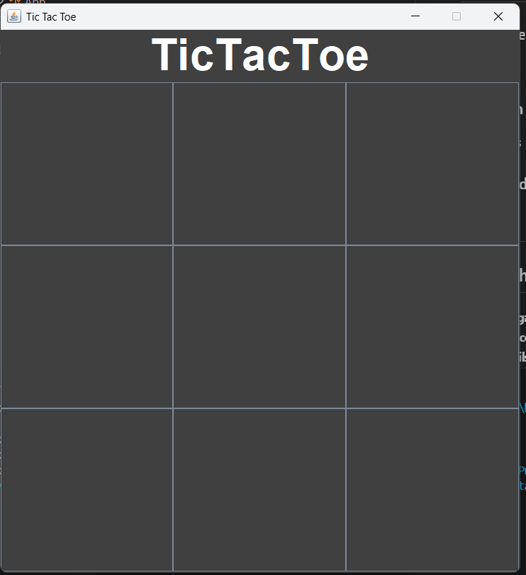
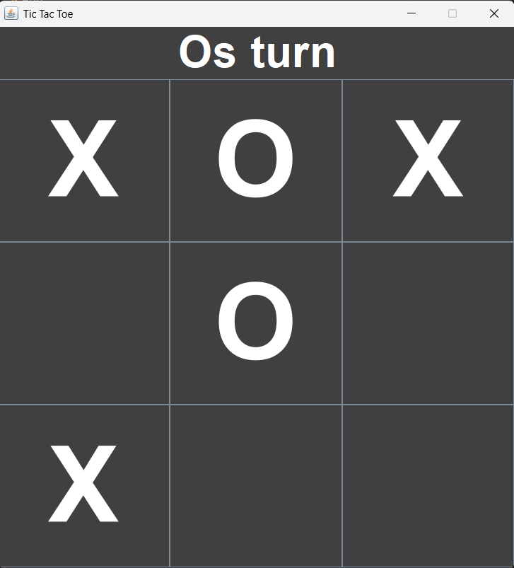
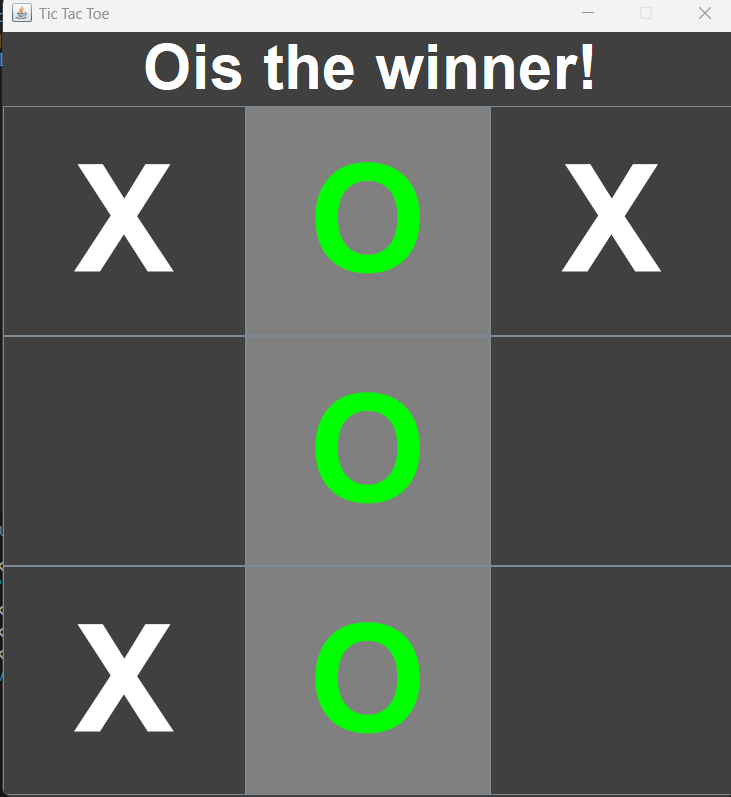
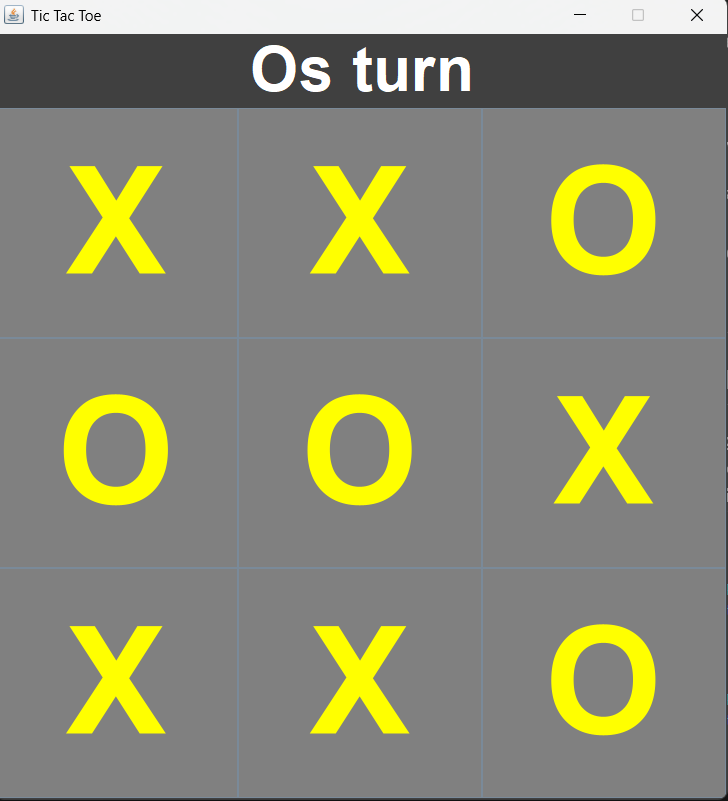

# 🎮 Jeu Tic-Tac-Toe - Portfolio


---

## 👋 Bonjour, je suis TakoBri

Bienvenue sur mon projet **Tic-Tac-Toe** !  
Ce projet est une démonstration de mes compétences en **Java**, **programmation orientée objet** et **logique de jeu**.

---

## 🔹 Aperçu du projet

Le Tic-Tac-Toe (ou Morpion) est un jeu classique où deux joueurs s’affrontent sur une grille 3x3 :

- **Joueur 1** : X  
- **Joueur 2** : O  
- **Objectif** : aligner trois symboles horizontalement, verticalement ou en diagonale  
- **Match nul** : lorsque la grille est pleine sans gagnant  

Ce projet inclut :

- Une interface console simple et intuitive  
- Validation des entrées utilisateur  
- Détection automatique des victoires et match nul  

---

## 📸 Captures d’écran

### Début de partie


### Partie en cours


### Victoire d’un joueur


### Match null


---

## 🛠️ Technologies et compétences utilisées

- **Langage** : Java  
- **Concepts clés** : POO, boucles, conditions, tableaux  
- **Outils** : Console, GitHub  
- **Compétences pratiques** : logique de jeu, validation, interface utilisateur simple  

---

## 🚀 Lancer le projet

### 1️⃣ Compiler le fichier
```bash
javac src/TicTacToe.java

## Exécuter le programme :
java TicTacToe